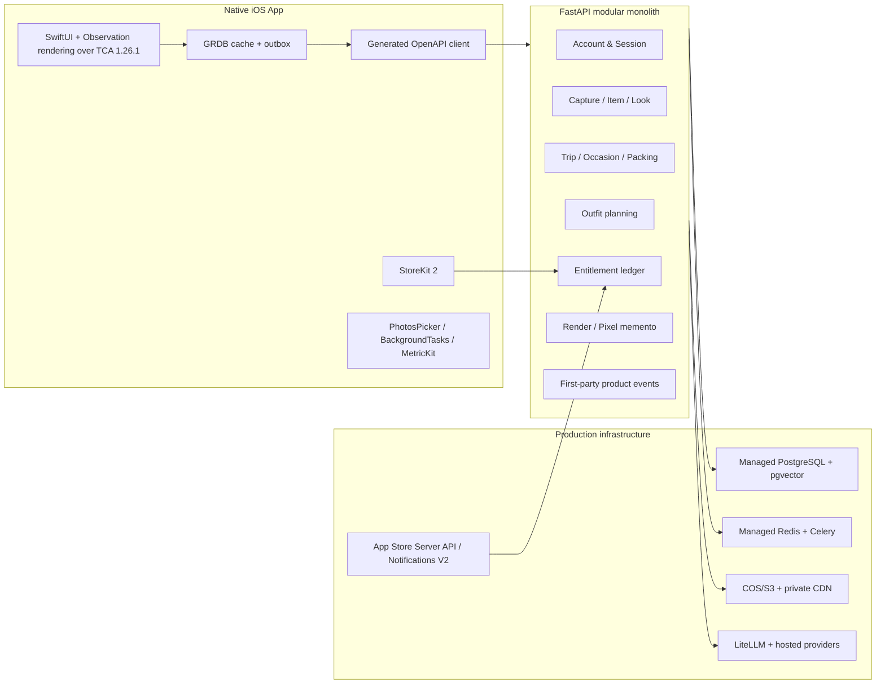

# StyleCapture Journey 技术设计

- 日期：2026-07-27
- 状态：实施基线；每个里程碑允许以 ADR 修订
- 平台：iOS 17+，Xcode 26.x / Swift 6.2+；现有 FastAPI Product API

## 1. 架构结论

独立 App 新增原生 iOS 客户端，但不新建第二套后端。继续使用现有 FastAPI 模块化单体、PostgreSQL/pgvector、Redis/Celery、S3-compatible 对象存储和 LiteLLM provider 边界；在资产层之上新增 `trip_planning` 与 `commerce` vertical module。



P0 不拆微服务。只有 GPU/render、媒体 ingest 或通知/import 在 SLA、故障域和部署节奏真实独立后才可提拆分 ADR。

## 2. iOS 工程

新目录：`apps/ios/StyleCaptureJourney/`。按 TCA-native feature-first 组织：feature owns reducer/state/action/view；pure domain rules 按真实复杂度放在 Feature-local `Domain` 或 `SharedDomain`，不强制每个 feature 拆齐 domain/application/infrastructure/interface 四层。外部 adapter 只放在 `Core/*`，跨 feature 仅通过公开 domain value、typed error 或 dependency client。建议结构：

```text
apps/ios/StyleCaptureJourney/
  App/
    AppFeature.swift
    AppView.swift
  Core/
    API/
    Auth/
    Database/
    DesignSystem/
    Entitlements/
    Observability/
  Features/
    Onboarding/
    Wardrobe/
    Journey/
    Packing/
    Paywall/
    PixelJournal/
    Settings/
  StyleCaptureJourneyTests/
  StyleCaptureJourneyUITests/
  StoreKit/
  Resources/PrivacyInfo.xcprivacy
```

### 2.1 默认框架

- XcodeGen `2.46.0` 从版本化 `project.yml` 生成 `.xcodeproj`；工程文件不手工编辑、不提交。只有模块数量、构建缓存或选择性测试出现实测瓶颈后才评估 Tuist。
- `scripts/bootstrap_ios.sh --check` 与 CI 首先校验 Xcode 26.x、Swift 6.2+ 和 XcodeGen 2.46.0；版本不匹配直接失败并打印精确升级命令。Xcode Cloud 在 `ci_scripts/ci_post_clone.sh` 生成工程后才 archive，并必须在空 checkout 中证明 workflow 能发现生成的 project/shared scheme；若平台首跑无法选择未提交的 project，则记录证据并降级为 GitHub macOS CI 签名 archive，或提交最小可审查 workspace/shared scheme，而不是静默依赖不可发现配置。
- The Composable Architecture `1.26.1` 是 production app shell，SwiftPM exact pin 到 tag commit `ead11e04e5011c437722c1990d22f80d87056978`，MIT license，官方审计源为 `https://github.com/pointfreeco/swift-composable-architecture` 与 `https://github.com/pointfreeco/swift-composable-architecture/releases/tag/1.26.1`。使用当前 non-deprecated APIs；因为 2.0 前存在 API churn，M2 前必须做一次迁移审计并记录 deprecation、navigation、dependency、TestStore 与 compile 影响。
- SwiftUI + Observation + structured concurrency 只负责渲染、系统生命周期和异步边界；TCA owns app/feature state、feature reducers、dependency clients、effects/cancellation、navigation state/state restoration 与 reducer tests。禁止自建 `AppRouter`、全局 `AppEnvironment`、ViewModel 架构、DI container 或第二套 navigation framework。
- App entry 由 `AppFeature`/`AppView` 组合 feature reducers。每个 feature 暴露 `State`、`Action`、`Reducer`、`View` 与窄 dependency client；Product API、GRDB、StoreKit、SIWA、Photos、BackgroundTasks、UserNotifications、Nuke、OSLog/MetricKit、clock/UUID 都通过 TCA dependency clients 注入。Views 只渲染 state 并 send actions，不直接 import infrastructure adapters 或 generated transport DTO。`StyleCaptureAPI` generated DTO import 只允许 `Core/API` adapter 与其测试；reducers、domain 和 application-like policies 只消费 dependency client 返回的 domain values/typed errors。
- NavigationStack/NavigationPath 由 TCA navigation state 驱动 tab、deep link 和 state restoration；不得另建 custom Router。Task 2 必须用 `TestStore` 证明启动、空 Journey shell navigation、state restoration、dependency override 与至少一个 cancellable effect 的测试 ergonomics，再展开功能。
- GRDB `v7.11.1` 管理 SQLite、显式迁移、查询、outbox 与同步状态；不以 SwiftData 作为商业数据真源。
- Apple Swift OpenAPI Generator `1.13.0` + runtime + URLSession transport 从 FastAPI OpenAPI 构建时生成客户端；禁止手写重复 DTO。所有 SwiftPM 依赖在 `project.yml` 使用 exact version/revision，禁止 branch/floating range；受版本控制的 `Config/Package.resolved` 是锁文件真源，bootstrap 复制到生成 workspace 的标准路径并做 byte check。
- OpenAPI 输入固定为 `apps/ios/StyleCaptureJourney/OpenAPI/openapi.json`，generator 配置为同目录 `openapi-generator-config.yaml`，生成到 DerivedSources 中的 `StyleCaptureAPI` module；`Package.resolved` 锁定 generator/runtime/transport，扩展后的 `scripts/export_openapi.py --output ... --check` 从同一 FastAPI schema 生成 H5/iOS 的 deterministic sorted JSON，并做 byte/diff check。
- Nuke `13.0.6` 负责远程图片加载、预取、内存/磁盘缓存和降采样。
- PhotosPicker + Transferable 做选择性照片导入；只有出现持续相册同步需求才使用 PhotoKit。
- 使用 CoreTransferable、UniformTypeIdentifiers 与 ImageIO 做类型协商、HEIC 解码、降采样和 metadata stripping；不手写图片格式解析。
- BackgroundTasks 只恢复上传、同步 outbox 和轻量预处理；重 AI 永不依赖系统后台时段。
- Network `NWPathMonitor` 只作为同步时机信号，不把 reachability 当请求必然成功；不引入自建/第三方 reachability。
- UserNotifications 负责穿着确认的本地提醒；通知正文不得出现精确城市、日期、酒店或衣物照片，拒绝权限必须有应用内恢复路径。
- OSLog/Logger + MetricKit 记录结构化诊断；敏感字段必须使用 private redaction。
- Swift Testing 测 domain/application；TCA `TestStore` 测 reducer state/effect/navigation/recovery；XCTest/XCUITest 测 UI、StoreKit、系统权限与可访问性。

BackgroundTasks identifier 是固定发布合同：

| Identifier | Apple task | 用途/条件 | 配置与 expiration |
|---|---|---|---|
| `com.stylecapture.journey.outbox-refresh` | `BGAppRefreshTask` | 短时 GRDB outbox 同步 | 加入 permitted identifiers；到期取消请求并保留 outbox 重试 |
| `com.stylecapture.journey.upload-resume` | `BGProcessingTask` | 用户已选择媒体的断点续传；requires network | 加入 permitted identifiers 与 `processing` background mode；到期安全关闭 stream、保留 offset |
| `com.stylecapture.journey.image-preprocess` | `BGProcessingTask` | 本地降采样/去 metadata；不运行模型 | 加入 permitted identifiers 与 `processing` background mode；到期删除不完整临时文件并可幂等重启 |

未列 identifier 禁止注册；重模型 planning/render、埋点常驻上传和轮询保活禁止伪装成后台任务。

### 2.2 离线与同步

服务器是账户、衣物、Journey、计划和权益真源；GRDB 是可离线读取的本地投影。所有可变实体带 `id`、`version`、`updated_at`、`deleted_at`。客户端 mutation 先写 outbox，再以 idempotency key 同步。

冲突规则：

- 用户手工修正衣物字段胜过模型回写。
- PackingItem 勾选采用字段级 last-write-wins，并保留 device/operation audit。
- 锁定的日程/Look 不能被天气刷新静默覆盖；服务端生成 revision，用户显式接受。
- 权益只由 Apple 已验证交易和服务端账本决定，客户端缓存只用于即时 UI。
- 删除使用 tombstone；本地和服务端均完成后才向用户报告完成。

## 3. 后端领域

新增 `services/backend/src/stylecapture_backend/features/trip_planning/`：

- `Trip`：owner、模板、日期、城市、时区、状态、版本。
- `Occasion`：时间段、室内外、正式度、活动、步行、dress code、用户锁定项。
- `PackingConstraint`：行李类型、件数/体积上限、洗衣、复穿偏好、体感。
- `WeatherSnapshot`：地点粒度、预报区间、采集时间、来源、置信/过期状态。
- `TripOutfitPlan`：引用 Occasion 与现有 OutfitPlan/Look，不复制 Item 事实。
- `PackingPlan` / `PackingItem`：引用 Item、穿着日、复穿次数、状态、缺口。
- `PixelRetentionState`：里程碑与已解锁 memento，不包含社交关系。

新增 `features/commerce/`：

- `StoreProduct`：稳定 product ID、类型、entitlement 映射。
- `StoreTransaction`：original/transaction ID、signed payload hash、环境、状态、有效期、撤销/退款。
- `EntitlementLedgerEntry`：grant/revoke/consume，业务幂等真源。
- `UsageReservation`：AI 操作预留、成功结算、失败释放，保证失败不扣次。
- `StatutoryTransactionRecord`：账户删除后仍须依法保存的最小账务事实；与产品 entitlement 查询隔离，不保留可继续画像的业务内容。

先修复 Alembic metadata 导入完整性，把 PixelTrial 与 ItemPresentation model 纳入，再添加新表。

服务端异步副作用统一使用 PostgreSQL transactional outbox/inbox，不以一次 `send_task` 成功代表业务已交付：

- `outbox_messages`：`id`、`subject_id`、aggregate type/id/version、event type、idempotency key、payload hash/encrypted payload、status、attempts、next attempt、lease、dead-letter reason。
- `inbox_messages`：consumer、message/event ID、payload hash、first/last seen、processed result，保证 Celery 重投、Apple 通知和 provider callback 幂等。
- dispatcher 使用 `FOR UPDATE SKIP LOCKED`/短 lease 批量发布；任务开始和最终写入都检查 subject tombstone。Trip planning、commerce、weather、deletion 和昂贵 AI job 不得绕过该边界。

## 4. Product API

新增端点使用 `/v1`、统一错误 envelope、idempotency、owner enforcement 与版本校验：

```text
POST   /v1/auth/apple
POST   /v1/auth/refresh
POST   /v1/account/delete
GET    /v1/account/deletion-status
POST   /v1/trips
GET    /v1/trips/{trip_id}
PATCH  /v1/trips/{trip_id}
POST   /v1/trips/{trip_id}/occasions
POST   /v1/trips/{trip_id}/wardrobe-selection
POST   /v1/trips/{trip_id}/plans
POST   /v1/trips/{trip_id}/plans/{plan_id}/replace
POST   /v1/trips/{trip_id}/plans/{plan_id}/lock
GET    /v1/trips/{trip_id}/packing-plan
PATCH  /v1/packing-plans/{plan_id}/items/{item_id}
POST   /v1/trips/{trip_id}/weather-refresh
POST   /v1/trips/{trip_id}/complete
POST   /v1/trips/{trip_id}/pixel-memento
GET    /v1/entitlements
POST   /v1/store/transactions
POST   /v1/store/notifications/apple
POST   /v1/product-events
```

耗时计划接口返回 `202 + job_id + status_url`；客户端订阅 Server-Sent Events 或在后台/重连后轮询。现有 outfit planning 继续独立可用，Trip application 只编排它，不复制推荐逻辑。

所有 mutation 的 `Idempotency-Key` scope 固定为 subject + HTTP method + canonical path + payload hash。相同 key/相同 payload 返回原响应；相同 key/不同 payload 返回 `409 IDEMPOTENCY_CONFLICT`。实体版本冲突返回 `412 VERSION_CONFLICT` 并携带当前 version；不得让 iOS outbox 猜测服务端是否写入。

### 4.1 Skill、App Intent 与 Agent 边界

商业深度属于 Product API capability，不属于 `SKILL.md` 或脚本。当前 `scene-outfit-matching`/collage Skill 只是旧单场景/渲染入口，provider-bound Doubao Skill 只是 ADR 0006 的独立 Codex 例外；三者都不能作为 Journey 商业能力或上线证据。

P0 只发布原生 iOS App，不发布可下载 Journey Agent Skill。后续 Apple App Intents/Shortcuts 只调用同一 iOS application service/generated client；未来外部 Skill 或 MCP gateway 只有在 delegated auth、同意、撤销、权益、成本、删除和安全审计通过后才能启用，并优先复用官方 MCP SDK/OpenAPI 暴露，禁止自造协议。完整 capability/auth/idempotency/entitlement/deletion/eval 合同见 `docs/architecture/JOURNEY-SKILL-CAPABILITY-REGISTRY.md`。

## 5. 认证、支付与隐私

- 默认 Sign in with Apple；服务端校验 issuer、audience、nonce、签名与时效，Apple `sub` 是稳定外部身份。签发 10–15 分钟 access token 与旋转 refresh token；refresh token 仅存 Keychain，服务端只保存 hash、`jti`、device session 与撤销状态。
- 客户端使用 AuthenticationServices 监听 credential state/revocation；Security/Keychain 项使用 `kSecAttrAccessibleWhenUnlockedThisDeviceOnly`，退出和删除必须验证 token/key 全部清除。
- 可先匿名体验；首次购买、云同步或第二设备前完成 Apple 账户绑定，原匿名主体原子迁移。
- StoreKit 2 处理商品、购买、恢复、交易更新与管理订阅入口。
- FastAPI 使用 Apple 官方 `app-store-server-library-python` 校验交易与 Notifications V2；通知按 notification UUID/transaction ID 幂等，定期用 history API 对账。
- App Store key、provider key、COS key 只存在服务端 secret manager；App 二进制不含可调用 AI 的密钥。
- 照片和行程默认私有；私密媒体使用短期签名 URL，公开 CDN 只承载用户主动分享且已去敏的 memento。
- iOS 私密照片写入 `NSFileProtectionComplete` 目录、默认排除备份；token 和设备密钥只进 Keychain。退出或删除时同时清理缩略图、URL cache 和 WebView storage。
- 账户删除采用持久状态机：冻结主体与撤销会话 → 取消/隔离任务 → 删除业务与媒体派生物 → 调用处理者删除 → 隔离法定账务记录 → 验证 active/backup SLA。旧任务必须因 subject tombstone 而无法复活数据。
- `subject_tombstones` 与最小 `deletion_requests` 随 account 模块创建；从第一个商业写路径开始，repository、job start/finalize 和 object-store write 都必须拒绝 tombstoned subject。完整处理者/backup 编排可在后续 deletion milestone 完成，但防复活不能后置。
- P0 中国大陆路径禁用境外 FASHN 真人试穿。任何真人照片处理者接入前必须通过 DPA、无训练、保留与删除、子处理者、数据驻留和 PIPIA/跨境机制审计。
- 每个 AI 图像派生物保存生成属性、服务提供者标识和内容编号；预览与导出渲染可见标签，下载/分享保留隐式元数据。
- 生产环境关闭或访问控制 `/docs` 与 `/openapi.json`；App Attest/DeviceCheck、用户级配额和异常成本封禁保护付费 AI 边界。

## 6. AI 与可解释计划

1. 规则层先校验天气、礼仪、保暖、鞋履、步行、必须/排除和行李限制。
2. pgvector + SQL 从 owned/selected wardrobe 召回封闭候选。
3. 现有 OutfitApplication 生成确定性 drafts。
4. LiteLLM `reasoning` alias 只排序和解释候选；输出经 schema、hard-rule 和 Item ownership 校验。
5. 失败时返回 rule-ranked 可用计划，并标记解释降级；不伪造 AI 成功。
6. Render 首发优先真实单品 collage；像素 memento 是派生物。FastFit 非商业代码不进入生产镜像。

### 6.1 部署级 AI 平台

- LiteLLM Proxy 是唯一模型网关，复用 capability alias、virtual key、provider routing、retry/fallback、rate limit、spend tracking 和 budget；业务代码不实现第二套路由/计费器，也不直接依赖模型 SDK。
- 三层成本职责不重叠：Commerce `UsageReservation` 是套餐权益/次数真源；LiteLLM 是 token、实际 spend、model/provider 真源；`RedisCostGuard` 只做实时并发、速率与滥用熔断。每个 job 以 outbox/job ID 绑定 reservation；失败/超时 release，业务成功后 consume，LiteLLM spend 仅用于审计、毛利和预算阈值。
- Celery + Redis 继续承载 capture、embedding、planning 和 render，配 PostgreSQL outbox/inbox、幂等键、late acknowledgement、bounded retry 与 dead-letter。P0 不引入第二个工作流引擎；只有跨天 saga 的恢复/可视化在生产成为瓶颈时才提 Temporal ADR。
- pgvector 继续保存衣物 embedding 并与 owner/category/availability SQL 过滤同库查询；达到 `>10k MAU` 或 `>100 万 Item` 阈值后基准测试 HNSW，再决定是否需要独立向量库。
- Promptfoo `0.121.19` 扩展现有 Product API eval，分三档：每个 PR 的离线/低成本 `smoke`，prompt/AI 边界变更的 `quality-gate`，release 的 `redteam`；执行固定数据集质量、schema/约束、prompt injection、越权与隐私断言，结果带 Git SHA 和配置版本。
- 软启动前在中国大陆区域部署通过 edition/control gate 的 Langfuse，以 OpenTelemetry/OTLP 接入 trace、token/cost、dataset、experiment 和 online/offline score。不得启用会记录 prompt/completion 的默认 LiteLLM Langfuse callback。若 OSS 版本缺少所需 retention、audit 或细粒度 RBAC，则必须用外部生命周期、私网 IdP/反向代理审计和自动删除证据补足，否则采购具备控制的授权版本；两者都不满足则阻断发布。
- OpenTelemetry Collector 统一接收 FastAPI/Celery/LiteLLM 的 traces/metrics，并按目的分别导向 Prometheus 和 Langfuse。客户端 MetricKit 只汇总崩溃/卡顿/启动指标，不把用户内容送入 AI trace。
- P0 不使用 LangChain、LlamaIndex 或通用 agent runtime：当前流程没有开放工具选择、长记忆或 RAG 文档图，领域规则与一次封闭候选 rerank 更可靠。出现真实 agentic workflow 后必须做 reuse/威胁/成本基准再立 ADR。

### 6.2 AI observability security invariant

- Production telemetry is metadata-only. 应用发射端使用版本化字段 allowlist，禁止创建 prompt/completion/system instruction/tool argument/result、图片、行程/自由文本、HTTP body/query、cookie/Authorization、SQL statement、Celery 参数或含用户内容的 exception 属性。
- OTel Collector 再执行独立 allowlist/drop 和 outbound allowlist。sanitizer/schema/redaction 失败时丢弃 telemetry 并告警，绝不转发原事件；Langfuse/Collector 不可用时产品请求 fail-open，但 telemetry privacy 始终 fail-closed。
- trace/user/session ID 使用按环境隔离的 HMAC 或短期不透明 ID，不使用原始 subject、行程、订单或设备 ID。生产/预发 project 和 key 分离，key 存 secret manager 并轮换。
- Langfuse 管理面只在私网/VPN/allowlisted ingress 暴露，TLS only，关闭公开注册、邮箱密码认证和部署 telemetry，使用 SSO + MFA、最小权限与可审计的管理员/角色/key/export/delete 操作。
- 数据计划覆盖 trace、observation、score、dataset/run、media/export、Collector retry/disk queue、Promptfoo cache/result/database/artifact、PostgreSQL、ClickHouse、object versions、replica 和 backup。加密且限权的 subject-to-observability deletion index 只保存 opaque trace/dataset ID 与 expiry，用于枚举删除和证据，按环境轮换 pseudonym key，并在 convergence evidence 到期后自删除。active database/replica/object version/queue/dataset 轮询删除到 verified absence；不可变备份按批准的 maximum-expiry 或 cryptographic-erasure SLA 退出，隔离恢复先重放 tombstone 后才可查询，不宣称即时逐行删除 snapshot。
- Promptfoo 作为锁文件/SBOM 内依赖，只在隔离 CI、`$RUNNER_TEMP` 和合成/授权脱敏 fixture 上运行：除已有 telemetry/sharing/redteam flags，再关闭 remote generation、template env vars、update、cache，使用 `--no-cache --no-share --no-write --no-table`，禁止生产凭据/数据和未认证 viewer，只保留扫描通过的 JUnit 结果。
- 隐私 canary 注入唯一邮箱、行程文本、base64 片段、token/cookie/subject 标记，随后直接查询应用/Celery/LiteLLM/WAF/exception logs、DLQ/retry、Langfuse stores/blob、Collector queues/spool、Prometheus labels、Promptfoo database/cache/stdout/stderr/output、CI logs/artifacts 和 provider mock capture，要求零命中并覆盖 sanitizer crash/exporter retry；同时要求一条 allowlisted metadata 正向到达。OTel semantic convention 或 Langfuse/LiteLLM 升级必须做 field-schema diff。

## 7. 分析、实验与转化

P0 使用一方 `/v1/product-events`、App Store Connect Analytics、StoreKit 交易和服务端 AI 成本表。事件由客户端批量写 outbox，不采集 IDFA、精确位置、自由文本、照片或 session replay。

Feature flags 与实验分配在服务端完成，sticky assignment 写入主体；事件携带冻结的 eligibility/offer/maturity 字段。P0 只有统一 ¥12 旅行包主 offer，不运行 pack-first vs subscription-first 混合实验；订阅不是 P0 默认 CTA，未来进入主 CTA 需单独产品决策。App Store 获客使用旅行意图 Custom Product Pages 与 Product Page Optimization，不自建商店页实验平台，并以上线后的生产 paid VSS/CAC 而非下载量判断优化方向。

当自建事件查询成为产品迭代瓶颈时，再评估国内可部署的成熟分析平台。神策 SDK 商业使用需采购许可；Firebase/Amplitude/PostHog Cloud 不作为 China-first 默认依赖。

## 8. 部署与扩展

### 阶段 A：验证与 TestFlight

- 单区域 Docker Compose core；托管模型；对象存储迁 COS；PostgreSQL/Redis 可先同机但有每日备份。
- 1 API、按 queue 1–2 Worker；并发遵循本机/服务器资源护栏。
- TestFlight 前完成 SIWA、StoreKit sandbox、删除状态机与大陆数据流抓包，不以匿名 HMAC cookie 作为商业账户方案。
- 所有 `BGTaskScheduler` identifier 同时进入 app 配置的 `BGTaskSchedulerPermittedIdentifiers` 与调度代码，并验证 expiration/denied/termination/relaunch。TestFlight/sandbox 交易只证明技术链路，不进入 WTP、生产转化、收入、退款或毛利。

### 阶段 B：软启动

- Tencent Cloud managed PostgreSQL、managed Redis、COS/CDN、负载均衡/WAF；API 至少 2 副本。
- Worker 按 `capture`、`render`、`trip_planning`、`imports` 分池；每个队列独立 HPA/告警。
- OpenTelemetry + Prometheus 指标；日志、trace 和图片严格分离。
- 境内 Langfuse edition/control gate 通过后才接收 metadata-only AI OTLP，Promptfoo 隔离数据集/红队作为部署门；Langfuse 或 Collector 故障不得阻断用户主链路。
- 软启动备份目标：业务数据库 RPO ≤24 小时、RTO ≤4 小时；上线前用隔离环境完成一次全量恢复。DB connection >75% 时先检查泄漏/查询并采用 pooler，再扩规格。
- CI 产出 secrets scan、SBOM、依赖审计、SAST、iOS archive privacy report 与第三方 SDK 签名/manifest 检查；发布使用 Xcode Cloud 的签名 archive 和受保护环境 secret。
- 生产 eligible paywall、付款、VSS、退款与毛利样本只用于上线后的经营与投放决策，不是基础设施交付、Task 10 或 aggregate Goal 完成硬门。

### 阶段 C：规模化

仍保持模块化单体与共享数据库。达到以下条件才扩容/分区/拆服务：

- 商业指标不触发开发停止或 Goal blocked；真实生产数据只能指导上线后的产品、投放和容量优先级，不能由 sandbox/TestFlight 代替。

- API 非 AI p95 >300ms 持续 10 分钟或 CPU >70% 持续 15 分钟：加 replica。
- DB 连接 >75%、CPU >70%、读 p95 >100ms 或写 p95 >250ms：先索引/查询计划，再 pooler/规格升级。
- 单 append-only 表 >1,000 万行或月增 >500 万：PostgreSQL 分区。
- 单队列 p95 wait >30s 持续 10 分钟或长度 > worker concurrency ×100：扩 Worker 或拆 queue。
- provider timeout >1%、5xx >2%：熔断、fallback 或 collage 降级。
- Redis used memory >70% 或出现 rejected writes：扩容/迁 HA；队列实例不使用会丢 job 的淘汰策略。
- 日模型预算达 80% 告警、95% 自动降级；命中用户额度 >5% 时重估套餐。
- >10k MAU 或 >100 万 wardrobe Item：增加 ANN index、离线偏好聚合和热点缓存。

## 9. 验证矩阵

每个里程碑必须依次通过：

1. domain/application 单测与 property/invariant 测试。
2. migration upgrade/downgrade、OpenAPI diff 与 generated Swift client 编译。
3. integration：Postgres、Redis/Celery、COS adapter、LiteLLM fake-through-port 与真实 provider smoke。
4. StoreKit config、sandbox、TestFlight、Notifications V2、退款/撤销/恢复/重复通知。
5. iOS 真机：弱网、断网、后台恢复、权限拒绝、低存储、动态字体、VoiceOver、小/中/大屏。
6. 真实用户旅程截图/录屏：initial、processing、success、failure、recovery、paywall、purchase、delete。
7. 独立 spec、architecture、security/privacy、code quality、conversion UX review；P0/P1 清零。
8. 安全专项：跨账户、SIWA nonce/replay、StoreKit 通知重放、删除后任务复活、未同意 AI 传输、显式/隐式 AI 标识和 production API 文档暴露。
9. 性能证据分层：PR 使用 XCTest/XCUITest performance、launch/hang smoke 和后端基准；MetricKit 只作为 TestFlight/生产真机日报与版本回归阈值，不伪装成即时 CI assertion。
10. WeatherKit 候选 smoke 记录 attribution、JWT/server signing、配额、十个目标中国城市的逐城市覆盖/时效，以及不可用时确定性降级证据；未通过则按 ADR 比较境内成熟天气 API。
