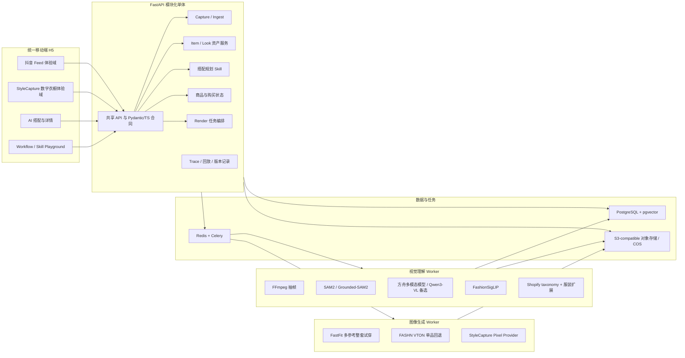
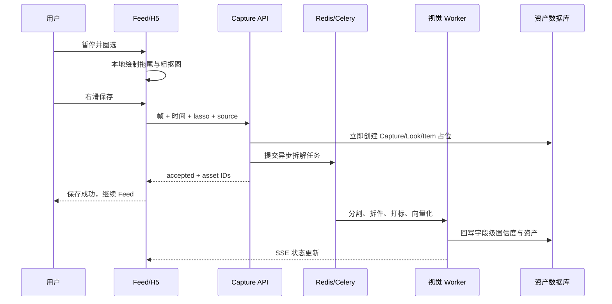

# 码上搭：技术选型与复用决策

状态：已收敛，可作为 PRD 技术输入
日期：2026-07-25

## 1. 结论

项目采用“一个产品、两个体验域、一个资产中台”的结构：

- Feed 体验域直接建立在现有抖音 Feed 复刻容器上。
- 数字衣橱体验域迁移 `StyleCapture-main` 的紫粉像素视觉、页面语义和角色资产。
- 两个体验域共享登录态、API、数据库、异步任务、Item/Look 和购买状态，不通过 iframe 或两个独立应用拼接。
- 系统采用 API-first：H5、Skill/Agent、后台 Worker、运营工具和未来外部合作方调用同一组版本化领域能力，页面不是服务能力的唯一入口。
- 后端采用 FastAPI 模块化单体；只有重模型推理因为 CUDA 依赖和 GPU 调度而拆成独立 Worker。
- Item 是衣橱原子事实，Look 保存单品之间的搭配关系；像素图和真人试穿图都是可重建的派生物。
- 用户右滑后立即完成“保存意图”的持久化，分割、拆件、打标、向量化和图片生成异步执行，绝不让 AI 时延卡住 Feed。
- 首版实现真实 2D 资产与真人试穿，不建设 3D 服装网格、布料仿真或可量体数字人。

## 2. 总体架构

## 3. 前端决策

### 3.1 工程骨架

- 以 `video-branch-main` 的 React/Vite/pnpm workspace 为正式骨架。
- 保留其移动 Feed、视频播放、暂停、时间锚点、共享合同、Playground 和 trace 接入方式。
- 迁移 `StyleCapture-main/prototype` 中的衣橱、穿搭详情、上传识别、聊天入口和像素资产，不保留旧原型的全局变量式状态与大段内联样式。
- 不采用 `wardrowbe` 的 Next.js 前端，避免形成第三种视觉语言和第二套路由/数据层。

### 3.2 双体验域

- Feed 维持抖音黑色、沉浸式、纵向滑动体验。
- 衣橱维持 StyleCapture 紫粉、像素、图鉴式体验。
- 两个域使用命名空间化主题变量和组件边界，避免 CSS 相互污染。
- 顶层应用只负责路由、用户会话、任务通知和共享数据客户端。
- 保存操作不强制跳出 Feed；衣橱通过常驻入口或用户主动跳转查看。

### 3.3 圈选与直接滑动

- 视频暂停后，用户在同一帧连续圈选一个或多个局部；每次闭环提供轻微抬升反馈。
- 600–800ms 无新圈选后，选区合并进入确认态。
- 圈选轨迹使用 SVG/Canvas，主体浮起与横滑使用 Motion 的 drag/transform 原语；不为这一效果引入 Three.js。
- 主体是抠出的视觉对象，不出现确认卡片；左滑放弃，右滑保存。
- 右滑后前端只显示轻量成功反馈和可选“喜欢原因”快捷项，不等待标签结果。
- 圈一个局部创建一个 Item 候选；圈多个局部创建一批 Item；圈整个人创建一个 Look，并异步拆出多个 Item。

### 3.4 前端状态

- TanStack Query 管理服务端状态、缓存、轮询/重试和失效。
- React reducer/context 管理当前 Feed 手势状态；不引入 Redux。
- 异步任务进度复用现有 SSE/streaming 能力。
- 列表中的 processing/partial/error 是正式产品状态，不以假结果填空。

## 4. 统一领域模型

### 4.1 Capture

记录用户输入与来源事实：

- 来源：feed、upload、camera、ecommerce。
- 原视频/图片引用、视频链接、帧时间、帧图、用户圈选路径、粗裁剪和最终 mask。
- 用户意图：单品、多个单品、整套穿搭。
- 处理状态、模型版本、失败原因和 trace ID。

Capture 永久保留来源证据，不能在 Item 去重后丢失。

### 4.2 Item

Item 是唯一单品资产：

- 品类树：大类、功能类别、细类。
- 可见属性：颜色、图案、材质、廓形、长度、领型、袖型、细节、品牌线索。
- 语义属性：风格、场景、季节、正式度、搭配角色和自然语言描述。
- 图像资产：原始帧引用、mask、透明单品图、最佳视图和 embedding。
- 来源与所有权分离：
  - `source_type`: feed / upload / camera / ecommerce
  - `ownership_state`: collected / wanted / purchased_pending / owned / archived
- 识别状态：processing / ready / partial / needs_review / error。
- 置信度按字段保存，不使用一个总分掩盖局部不确定性。

### 4.3 Look

Look 表示一套有关系的穿搭，不复制 Item：

- 关联的 Item 及层级/位置。
- 来源：feed_saved / user_created / ai_generated。
- 原始整套画面。
- AI 提取的搭配逻辑：轮廓平衡、色彩关系、材质关系、层次、视觉重心、风格、场景。
- 用户可选喜欢原因。
- 像素封面、真人试穿等派生物引用。

被遮挡、无法可靠拆出的单品可以作为 `pending component` 暂挂在 Look 下，不强行制造确定 Item。

### 4.4 OutfitPlan

OutfitPlan 是一次需求下的候选方案：

- 用户场景、风格、天气、禁忌和锚定单品。
- Item 集合以及每件的作用。
- 是否完全来自 owned/collected 衣橱。
- 缺失槽位与候选商品。
- 搭配解释、约束满足情况和用户反馈。
- 试穿、拼贴、像素封面等 RenderArtifact。

### 4.5 PreferenceSignal

偏好不写死在 Item 标签中，而作为独立事件沉淀：

- 保存/放弃单品。
- 保存整套 Look。
- 用户填写的喜欢原因。
- 采用、替换、编辑或购买某套方案。
- 来源权重按目标区分：资产可用性以 owned 为主；审美偏好以主动收藏 Look 和修改行为为主。

### 4.6 CommerceOffer 与购买状态

- Item 事实和商品 Offer 分离，同一 Item 可以有多个商品候选。
- “补齐这套”只收集 OutfitPlan 中缺失的 Offer。
- 购买后由 wanted/collected 进入 purchased_pending；确认收货后进入 owned。
- 首版提供聚合购买清单与逐项跳转，真正的一键下单取决于抖音电商开放能力。

### 4.7 RenderArtifact

统一记录拼贴、真人试穿、像素封面和未来动画：

- 输入 Item/Look/UserProfile 版本。
- provider、模型、参数、种子和内容哈希。
- queued/running/succeeded/failed 状态。
- 输出地址、缩略图、失败原因和可见降级。

RenderArtifact 永远不是 Item 或 Look 的事实真源。

## 5. 入库 Workflow

### 5.1 处理步骤

1. 前端从当前视频精确截帧，上传归一化 lasso 坐标、帧时间和来源。
2. API 先保存原始输入并返回，保证 Feed 交互时延与 AI 解耦。
3. FFmpeg 按时间戳提取原帧；必要时读取相邻少量帧。
4. SAM2 根据 lasso/box/mask prompt 细化主体；相邻帧只用于遮挡恢复和选择更清晰视图。
5. 当用户选择整套或主体含多件服饰时，Grounded-SAM2 产生候选区域。
6. VLM 对整套和候选单品生成严格结构化输出。
7. taxonomy normalizer 把模型自由文本映射为稳定分类，同时保留原始描述。
8. FashionSigLIP 生成图文向量；pHash + embedding + 来源证据用于相似提醒。
9. 强证据才自动合并；不确定时保留候选或请求用户后续确认，不在 Feed 中打断。
10. Look analyzer 总结搭配关系并写入 Look。

### 5.2 唯一真源与去重

- 原始 Capture 不合并。
- Item 可以合并多个 Capture，但自动合并必须同时满足高视觉相似、品类一致和来源不冲突。
- “相似”不是“相同”；相似 Item 默认只提示，不自动覆盖。
- 用户纠正字段后，后台打标不得覆盖人工值；复用 `wardrowbe` 的 guarded update 模式。

## 6. 标签和分类机制

### 6.1 三层分类

1. 展示层：上衣、下装、连衣装、外套、鞋履、包袋、头饰、饰品、美妆/其他。
2. 功能层：贴身层、中间层、外搭层、主体下装、连体主体、鞋、携带配件、佩戴配件。
3. 细分类：衬衫、针织衫、风衣、直筒裤、半身裙、乐福鞋等。

展示层借鉴闪耀暖暖的易懂导航，但技术真源使用稳定 taxonomy ID，不把游戏标签直接当后端 schema。

### 6.2 属性层

- 客观可见：颜色、图案、材质线索、版型、长度、结构细节。
- 可推断：季节、正式度、适合场景、风格。
- 关系属性只属于 Look：配色方式、层次、比例、材质对比、视觉焦点。
- 每个字段保留 `value / confidence / source / model_version`。
- 自然语言描述与结构化标签并存：标签用于过滤和规则，描述用于检索、解释和生成。

## 7. 搭配 Skill

搭配不是单次 Prompt，而是可测试的 Workflow：

1. 解析用户输入：场景、天气、风格、正式度、身体/尺码约束、必须使用或排除的单品。
2. 从 owned 优先召回，再查 collected/wanted；商品库只补缺失槽位。
3. pgvector 进行语义召回，SQL 同时执行品类、季节、所有权和状态过滤。
4. 确定性规则检查完整性、层级冲突、连衣装与上下装冲突、色彩/正式度和场景硬约束。
5. 组合并重排，生成 3–4 套有明显差异的候选。
6. VLM/LLM 只负责难以规则化的审美重排和解释，不负责绕过硬约束。
7. 输出每件 Item 的来源、缺失项、替换候选和搭配逻辑。
8. 用户替换某件时只重算受影响槽位，不重新生成整套不可控结果。

推荐优先级为：`owned > collected/wanted > commerce offer`。
“衣橱里没有完整搭配”是 Workflow 的可解释分支，不是模型随口判断。

## 8. 真人试穿、像素与 3D

### 8.1 真人试穿

- FastFit 负责多参考整套生成，支持上衣、下装、连衣装、鞋和包；部署为同一 GPU 主机上的隔离推理容器。
- FASHN VTON 1.5 负责单件上衣/下装/连衣装试穿，也是 FastFit 失败时的质量回退。
- 用户上传的全身参考照是可选资料；没有参考照时显示固定模特或真实单品拼贴，不假装是用户本人。
- 现场演示允许命中同一真实输入的内容哈希缓存，但缓存必须来自此前真实任务，并显示 cached 状态；禁止 hardcode 某个请求返回预制图。
- FastFit 当前许可证只允许非商业 Demo；商业化前必须取得授权或替换。

### 8.2 像素封面

- 复用 StyleCapture 的 pixel provider router 和角色视觉资产。
- 输入是已完成的整套 Look 视觉，不从低粒度标签直接生成，避免进一步丢失服装关系。
- 固定用户角色身份，服装和配件随 Look 变化。
- 只作为衣橱缩略图、分享卡和转场，不承担穿搭判断。

### 8.3 3D

首版明确不做：

- 单张照片无法可靠得到可量体身体模型、可分离服装网格、材质参数和真实布料物理。
- ECON/SMPL-X/4D-DRESS 适合未来研究，但引入复杂许可证、长推理链和不可控误差。
- 当前赛题价值通过 2D 资产理解、整套关系、真人试穿和购买闭环已经完整体现。

未来只有在获得多视图人体、商品版型/尺码数据和独立 3D 资源后，才启动 3D ADR。

## 9. 后端与 API

### 9.1 服务形态

- FastAPI 模块化单体承载用户、Capture、资产、搭配、商品、渲染编排和 trace。
- 使用 Pydantic 定义服务合同，并生成/维护对应 TypeScript 类型。
- 复用 `video-branch-main` 的 API、Agent CLI、Skill 和 Playground 共享服务模式。
- 复用 `wardrowbe` 的 SQLAlchemy 模型、迁移、AI provider 和异步任务生命周期，但统一接入 Celery 并转换成当前领域语言。
- 不拆用户服务、衣橱服务、推荐服务等多套独立微服务。

### 9.2 主要接口

- `POST /v1/captures`：提交 Feed/上传/拍照输入，立即返回资产占位与 job。
- `GET /v1/jobs/{id}` 和 `GET /v1/events`：查询/SSE 接收处理状态。
- `GET /v1/wardrobe/items`：按品类、来源、所有权和状态筛选 Item。
- `GET /v1/looks`：查询已保存、用户创建和 AI 生成的 Look。
- `PATCH /v1/items/{id}`：用户纠正、所有权变更和归档。
- `POST /v1/outfit-plans`：根据需求或锚定单品生成 3–4 套方案。
- `POST /v1/outfit-plans/{id}/replace`：替换指定槽位。
- `POST /v1/render-jobs`：生成真人试穿、拼贴或像素封面。
- `GET /v1/purchase-lists/{plan_id}`：返回缺失项和商品 Offer。
- `POST /v1/feedback`：记录保存、放弃、替换、穿着和喜欢原因。
- `GET /v1/traces/{id}`：为 Playground 和评审提供 Workflow 证据。

### 9.3 幂等与版本

- 写接口接受 idempotency key，防止滑动/网络重试产生重复资产。
- 每次模型任务记录 schema、taxonomy、prompt、模型和 embedding 版本。
- 旧资产通过后台 re-enrichment 迁移，不阻断用户读取。

### 9.4 API-first 分层

服务能力按调用方分成两层，共享同一个领域实现，不能复制业务逻辑：

1. Product API：供 H5、小程序、Skill/Agent、内部工具和后续获授权调用方使用。
2. Worker API：只在私有网络中用于队列 Worker 取任务、回写结果和心跳，不对普通客户端开放。

Product API 必须满足：

- 使用 `/v1` 等稳定版本前缀；FastAPI OpenAPI 是合同真源。
- 从 OpenAPI 生成前端 TypeScript 客户端，并提供 Python/cURL 示例；H5 和 Skill 不各写一套请求结构。
- 长任务统一采用 `202 Accepted + job_id`，通过查询或 SSE 返回完成状态。
- 上传采用预签名对象存储 URL；业务 API 接收 object key、来源和结构化元数据。
- 产品用户使用正常登录会话；私有 Worker 使用 scoped service key。
- 所有请求携带 request ID；写请求支持 idempotency key；响应关联 trace ID。
- 所有资源按 user ID 隔离；上传大小和 GPU 并发在服务端限制。
- 错误采用稳定的机器可读 code、可恢复标志和用户可理解 message，不暴露 provider 内部异常。
- Provider、模型和部署平台隐藏在领域 API 后面，外部调用方不依赖 FastFit、SAM2 或某个具体 VLM 名称。

### 9.5 可封装能力

以下能力既服务项目内部，也可独立作为 API 产品：

- Garment Ingest API：图片、视频帧或圈选区域进入结构化 Item/Look。
- Wardrobe API：资产查询、纠正、来源/所有权管理、相似检索和导出。
- Outfit Planning API：场景需求或锚定 Item 生成方案、替换槽位和解释。
- Try-on / Render API：生成拼贴、单品试穿、整套试穿和像素封面。
- Commerce Completion API：根据 OutfitPlan 输出缺失槽位、Offer 和购买清单。
- Trace API：返回当前用户或内部授权任务的状态、版本和 Workflow 证据；默认不暴露敏感提示词或用户媒体。

每项能力都要有 OpenAPI 文档、最小调用示例、异步状态说明、错误表和一条真实 smoke 测试。服务封装目标是复用领域能力，而不是把内部数据库表直接暴露出去。

## 10. 数据与基础设施

- PostgreSQL 负责用户、资产、关系、任务元数据和商品状态。
- pgvector 与同库 SQL 过滤组合，首版不引入 Qdrant。
- Redis + Celery 承担短中时长任务、重试、dead-letter 处理和 GPU 并发控制；不引入 Temporal。
- 对象存储保存源图、帧、mask、透明图、试穿图和像素图。
- 对象 URL 使用短期签名，数据库只存对象 key。
- Core API 与 GPU Worker 只交换对象 key 和结构化合同，不传超大 Base64。
- trace 复用现有实现；未证明不足前不增加 Langfuse 等第二套观测系统。

## 11. 部署

### 11.1 开发与部署解耦

- 服务器采购和正式部署推迟到产品切片开发完成、真实模型组合与显存峰值有测量结果之后。
- Issue 1–5 的开发不得以“没有 GPU 服务器”为阻塞理由。开发环境先运行 H5、FastAPI、PostgreSQL/pgvector、Redis/Celery 和普通 Worker。
- 视觉理解、分割、试穿和像素生成统一通过 provider contract 调用；开发期优先选择真实托管 API、Apple Silicon/CPU 可运行的轻量模型或已有 StyleCapture provider。
- runtime 仍禁止 mock、stub 和固定结果。某个重 provider 暂时不可运行时，必须使用真实轻量 provider、真实托管 provider，或明确降级为真实单品拼贴，而不是伪造 AI 产物。
- FastFit/FASHN 的适配器、合同测试和容器配置可以先完成；自托管重模型的 live smoke 放到最终部署 Issue，不阻塞前端、领域、API、任务编排和完整交互开发。

### 11.2 单机 GPU Demo

需要自托管重模型时，Demo 采用一台 GPU 服务器，不再要求“CPU Core 主机 + Serverless GPU”两套计算资源：

- 安全上限建议：NVIDIA L40S、RTX 6000 Ada 或 A6000 48 GB，16 vCPU，64 GB RAM，300–500 GB NVMe，Ubuntu 22.04，固定 CUDA/PyTorch 兼容矩阵。租用前必须用最终 provider 组合测量峰值显存；若轻量模型或托管推理已满足质量，不强制采购该规格。
- 同机通过 Docker Compose 运行 Nginx/H5、FastAPI、PostgreSQL/pgvector、Redis/Celery、视觉容器和试穿容器。
- SAM2.1 small/base 本身较轻，不是选择 48 GB 显存的主要原因；显存余量主要用于 FastFit/FASHN、可能的本地 VLM，以及避免多套模型与预处理组件共存时反复 OOM。
- 重 GPU 任务默认并发为一；任务完成后允许容器卸载模型或释放显存。服务隔离是为了解决 CUDA/Python 依赖冲突，不代表需要多台机器。
- 24 GB GPU（如 RTX 4090/A10）是预算备选：VLM 必须走外部 API，重模型严格串行，并在真实素材上通过峰值显存测试后才能采用。
- 视频、原始帧、mask、透明单品图、试穿图和像素封面进入腾讯云 COS；服务器只保存缓存、模型权重、数据库和日志。
- 对公网只开放 80/443 和受限管理入口；PostgreSQL、Redis、Celery 与 Worker 端口不得暴露公网。

### 11.3 现有 4 核 8G 主机

南京一区标准型 SA9（4 vCPU / 8 GiB / 5 Mbps / Ubuntu）不作为重模型主机，但可在需要时承担轻量开发、API 联调或备份入口。租用 GPU 服务器后再决定停用或保留，避免开发阶段提前清理造成无谓阻塞。

旧服务和数据可清理，但必须先只读盘点容器、进程、端口、数据库、上传文件、环境变量和证书，备份仍需保留的数据库与配置，再按明确清单删除；禁止直接执行全局 Docker 清理或递归删除。

### 11.4 国内长期部署

- 首个真实试点仍可沿用单机 GPU 架构；只有监控数据证明数据库、API 或 GPU 互相争抢资源时才拆分。
- 数据增长后优先把 PostgreSQL 迁移到托管服务，计算层仍保持同一领域 API。
- 媒体层保持 S3-compatible 适配器，当前部署使用 COS，避免上层领域 API 绑定某个厂商。
- 多模态理解默认通过可配置中文 VLM API，紧急情况下可在 48 GB 主机运行紧凑型本地 VLM。
- GPU 镜像保持平台无关，未来可以原样迁移到其他国内 GPU 资源。

## 12. 真实链路与降级规则

- 运行时禁止 mock、stub、prompt-keyed 假结果。
- 自动化测试允许 fake provider，但必须通过同一接口合同。
- AI 不可用时展示 processing/error/retry，不能伪造标签或试穿图。
- 分割失败时保留用户粗选区和 Capture，允许后台重试或衣橱内补充确认。
- 拆解部分成功时 Look 可用，可靠 Item 进入 ready，不确定项进入 partial。
- 试穿失败时降级为真实单品拼贴，并明确不是试穿。
- 商品 API 不可用时保留缺失槽位和搜索词，不生成虚假商品库存。
- 真实成功结果可以按输入内容哈希缓存；缓存命中必须可追踪。

## 13. 安全、隐私与权利

- 用户真人照、身材信息和衣橱默认私有，可单独删除。
- 日志不记录图片 Base64、长期签名 URL、面部原图或 provider 密钥。
- VLM 返回视为不可信输入，必须 schema 校验，不能直接触发购买或工具调用。
- Capture 保存来源链接、帧时间和处理依据，支持删除、撤回和版权处置。
- 电商购买必须经过用户确认，AI 不能自动下单。

## 14. 测试边界

最高层测试 seam 是同一条真实纵向链：

`提交 Capture -> 异步完成 Item/Look -> 衣橱可查询 -> 生成 OutfitPlan -> 生成/降级 RenderArtifact -> 购买清单`

测试分层：

- 合同测试：Pydantic 与 TypeScript 请求/响应一致，未知字段和非法 taxonomy 被拒绝。
- 领域测试：所有权、来源、Item/Look 关系、去重和人工值保护。
- Workflow 测试：衣橱优先、缺失槽位、连衣装冲突、替换局部重算。
- Worker 测试：任务幂等、重试、部分成功、超时和回写竞态。
- 前端 E2E：移动端 Feed 圈选/左右滑、继续刷、衣橱状态更新、搭配编辑和补齐清单。
- 视觉回归：Feed 视觉、StyleCapture 衣橱主题、主体浮起和像素封面。
- Real smoke：至少一条真实视频/图片、真实 VLM、真实分割、真实数据库和真实试穿；结果和 trace 保存为验收证据。
- 许可证检查：FastFit 只能出现在 Demo 配置，生产构建必须阻止启用。

## 15. 赛题交付覆盖

- 产品文档：痛点、完整交互、AI Workflow、增长与购买闭环。
- 可体验 H5：Feed、圈选、数字衣橱、搭配、详情、补齐购买。
- Skill/Agent：调用与 H5 相同的 Capture、OutfitPlan 和 trace API。
- Playground：展示需求理解、视觉拆解、规则分支、模型调用、降级与最终结果。
- 分享传播：像素 Look 封面/分享卡。
- 冷启动：上传/拍照 + 预置但真实入库的衣橱；随后由 Feed 收藏和反馈持续丰富。

## 16. 关键复用决策

| 模块 | 最终选择 |
|---|---|
| Feed 与工程骨架 | 直接复用 `video-branch-main` |
| 衣橱视觉和像素资产 | 迁移复用 `StyleCapture-main` |
| 资产/异步任务模式 | 适配复用 `wardrowbe` 后端 |
| 视频帧与上下文 | FFmpeg；PySceneDetect 按需 |
| 圈选分割 | SAM2 |
| 整套拆件候选 | Grounded-SAM2 |
| 中文细粒度理解 | 方舟可配置视觉模型；Qwen3-VL 备选 |
| 分类与属性词表 | Shopify Product Taxonomy + 本项目服装扩展 |
| 服装相似检索 | Marqo FashionSigLIP + pgvector |
| 搭配推荐 | SQL/向量召回 + 硬约束规则 + LLM/VLM 重排 |
| 多参考整套试穿 | FastFit，非商业 Demo 条件采用 |
| 单品试穿/回退 | FASHN VTON 1.5 |
| 像素封面 | StyleCapture pixel provider router |
| 异步任务 | Redis + Celery |
| 开发/部署 | 本地或真实轻量/托管 provider 先开发；测量后再决定是否使用单台 48 GB GPU 主机 |
| 国内对象存储/模型 | 腾讯 COS + 可配置中文 VLM API |
| 3D | 不进入当前范围 |
